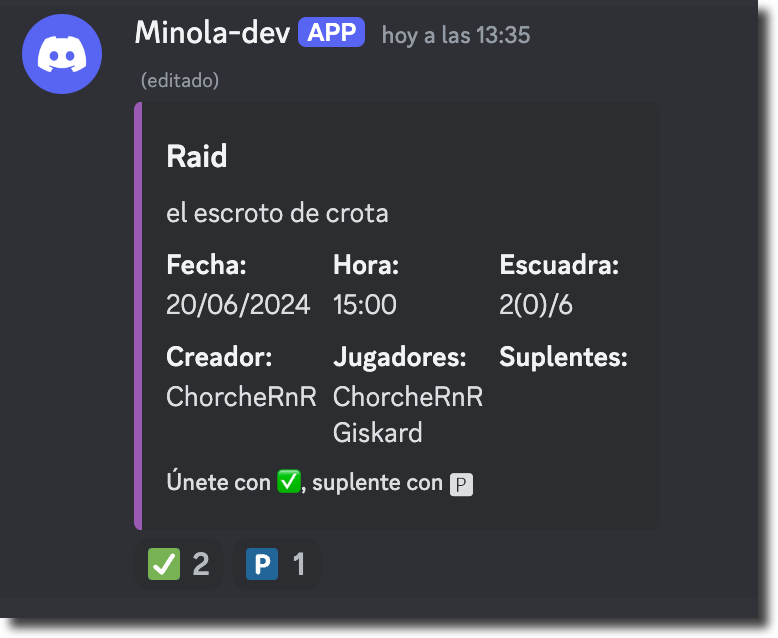

# simbiobot
Discord bot for Destiny 2 - [Los Simbiontes](https://discord.gg/kj4g4dwD)

Simbiobot is a Discord bot designed to organize events and allow users to sign up using message reactions.

## Requirements

- Python 3.8 or higher
- `pip` (Python package manager)

## Installation

1. Clone this repository:

   ```bash
   git clone https://github.com/yourusername/simbiobot.git
   cd simbiobot

2. Install requirements (virtual environment recommended)

    ```bash
    pip install -r requirements.txt

3. Store the token created in the [Discord Developeer Portal](https://discord.com/developers/docs/resources/application)

    ```bash
    echo "DISCORD_TOKEN=your-discord-token" >> .env

4. Generate an invitation link from the Discord Developer Portal and invite the bot to the server.

## Usage

1. The configuration is stored in yaml format in [common.yaml](./configs/common.yaml) and [config.prod.yaml](./configs/config.prod.yaml).

2. Run the bot

    ```bash
    python3 bot.py 

## Commands
### Config manager

The `ConfigManager` cog allows administrators to change the bot's language and set the event channel.

#### Language change
Use aliases !language, !lang", !idioma

```
!language
```

#### Set events channel
Use aliases !set_event_channel, !canal_eventos

Use the channel mention as argument

```
!set_events_channel #eventos 
```

### Events organizer
The `create_event` command allows you to create a new event with specified details. This command can be invoked using any of the following aliases: `create`, `event`, `new`, `add`, `crear`, `evento`.
##### Arguments

- **name**: The name of the event. This should be a short and descriptive title for your event.
- **description**: A brief description of the event. This should provide more details about what the event is about.
- **date**: The date of the event in `YYYY-MM-DD` format. Make sure the date is valid and follows the specified format.
- **time**: The time of the event in `HH:MM` format. Ensure the time is valid and follows the 24-hour format.
- **capacity**: *(Optional)* The maximum number of participants for the event. The default capacity is 3, and it can be set to any value between 1 and 12.

##### Examples

- Creating an event with a specific capacity:
```
!create_event “Game Night” “A fun night of board games and snacks.” 2024-07-15 19:00 5
```
